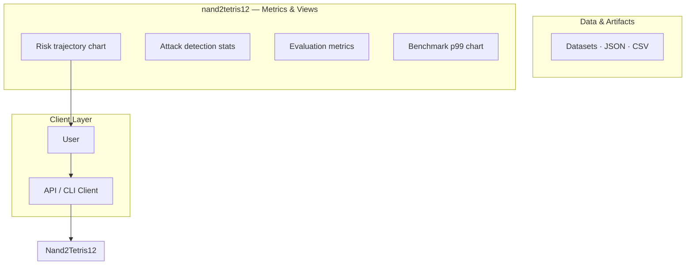
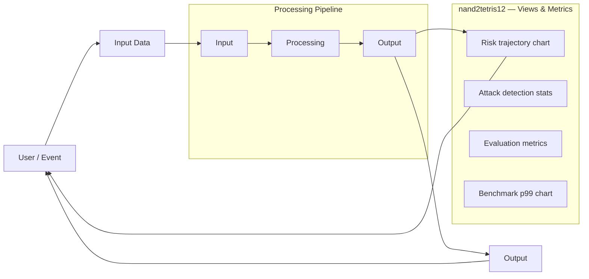
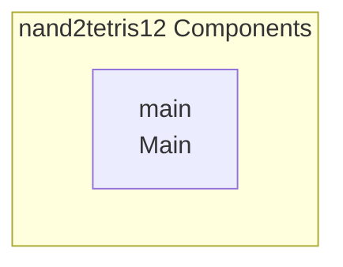

# Nand2Tetris12

This repository implements digital logic components and computer architecture concepts, following the principles outlined in 'The Elements of Computing Systems' (Nand2Tetris).

## Overview

This project is a practical implementation of digital logic design, simulating the construction of computer components from fundamental principles. It utilizes Hardware Description Language (HDL) to define and test various digital circuits, such as AND gates and Multiplexers (DMux).

## Features

*   **Digital Logic Implementation:** Contains implementations of core digital logic components (e.g., And, DMux).
*   **Hardware Description Language (HDL):** Uses dedicated `.hdl` files to define the logic gates and components.
*   **Component Testing:** Includes structured testing and simulation files (`.tst`, `.out`) to verify component functionality.

## Technology Stack

The primary technology used in this project is:
*   Scilab

## Project Structure

The project utilizes a highly structured directory layout, particularly within the `projects/` subdirectory. Each specific component directory contains multiple files detailing its definition, logic, and testing:

*   **`.cmp`**: Component definition file.
*   **`.hdl`**: The Hardware Description Language file defining the component's logic.
*   **`.out`**: Output or simulation file.
*   **`.tst`**: Test file used for verifying component functionality.

### Directory Contents

*   `./`: Contains the `README.md`.
*   `docs/`: Contains supporting documentation, including `docs/readme-agent/banner.svg`.
*   `projects/`: Contains the core logic implementations (e.g., `projects/01/And.cmp`, `projects/01/DMux.hdl`, etc.).

## Setup Guide

_Setup commands could not be extracted from the repository._

## System Architecture

High-level system design, data flows, API map, and workflow pipelines derived from the repository structure.

### System Architecture

### Data Flow & Charts Pipeline

### Component & API Map

