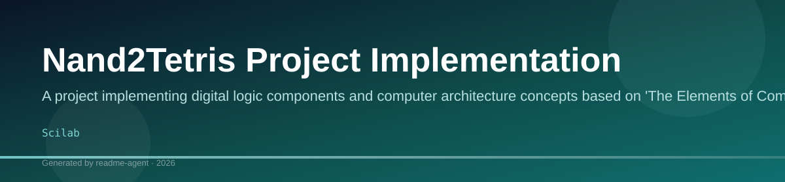
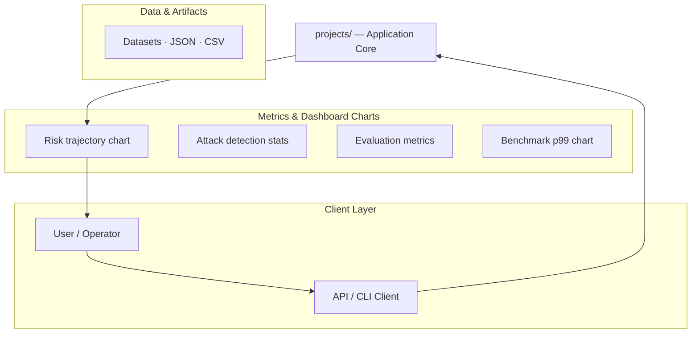
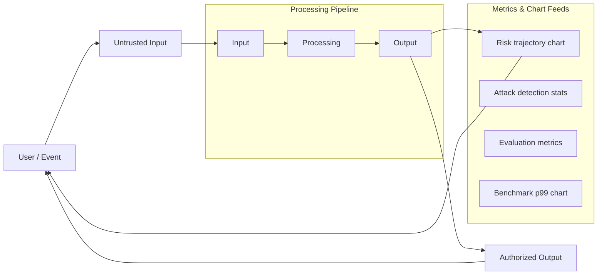
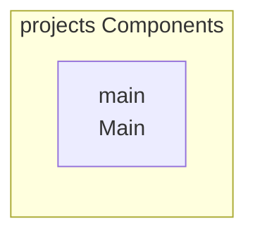

# Nand2Tetris Project Implementation

A project implementing digital logic components and computer architecture concepts based on 'The Elements of Computing Systems'.

## Overview

This repository contains files related to the Nand2Tetris course material, which is based on the book "The Elements of Computing Systems" by Nisan and Schocken. The project structure suggests the implementation of various digital logic components (like And and DMux) using Hardware Description Language (HDL) and corresponding simulation/test files.

## Key Features

- Implementation of digital logic components (e.g., And, DMux)
- Use of Hardware Description Language (HDL) files (.hdl)
- Testing and simulation of components (.tst, .out)

## Technology Stack

- Scilab

## Nand2Tetris Project Implementation

A project implementing digital logic components and computer architecture concepts based on 'The Elements of Computing Systems'.

This repository contains files related to the Nand2Tetris course material, which is based on the book "The Elements of Computing Systems" by Nisan and Schocken. The project aims to simulate the construction of digital logic components and computer architecture from fundamental principles.

### Features

This project includes:
*   Implementation of core digital logic components (e.g., And, DMux).
*   Use of Hardware Description Language (HDL) files (`.hdl`) for component definition.
*   Testing and simulation capabilities using dedicated test and output files (`.tst`, `.out`).

### Project Structure

The project utilizes a structured directory layout. The main components are housed within a `projects/` subdirectory. Each specific component directory contains multiple files detailing its definition and testing:

*   **`.cmp`**: Component definition file.
*   **`.hdl`**: The Hardware Description Language file defining the component's logic.
*   **`.out`**: Output or simulation file.
*   **`.tst`**: Test file used for verifying component functionality.

### Technical Stack

The primary technology used in this project is:
*   Scilab

### Attribution

//Name: Punya Mittal
// Reg No: 24BAI1325
//
// This file is part of www.nand2tetris.org
// and the book "The Elements of Computing Systems"
// by Nisan and Schocken, MIT Press.

## Setup Guide

_Setup commands could not be extracted from the repository._

## System Architecture

High-level system design, data flows, API map, and workflow pipelines derived from the repository structure.

### System Architecture

### Data Flow & Charts Pipeline

### Component & API Map

